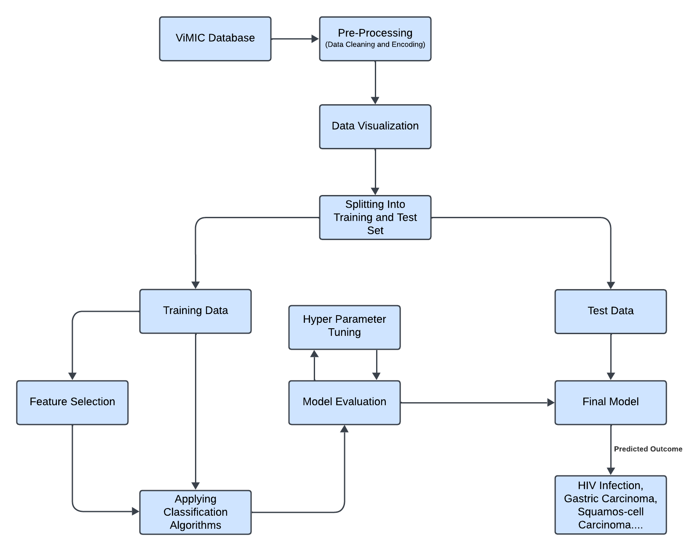
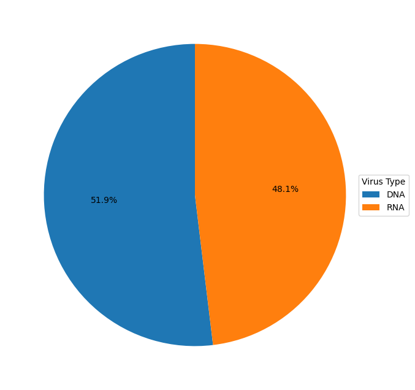
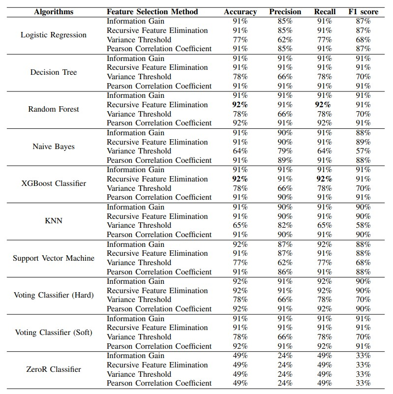

## :newspaper: A Machine Learning Approach to Classify Carcinomas and Infections According to Viral Integration

Viruses play a major role in the development of several infections and cancers by integrating into the human genome and disrupting normal cellular functions. This project presents a machine learning–based framework to automatically classify diseases associated with viral integration sites, enabling early detection and improved clinical outcomes.

Using the publicly available **ViMIC** dataset, the study initially analyzed data from **8 viruses and 77 diseases**, which was later refined through preprocessing to **6 viruses and 10 diseases**, totaling 32,151 records. Multiple feature selection techniques and nine machine learning models were evaluated. While variance-based feature selection performed poorly, RFECV (Recursive Feature Elimination with Cross-Validation) produced the most informative feature sets.

### :open_file_folder: Data Collection

Data was sourced from the publicly available ViMIC database, which compiles viral integration site (VIS) information from published literature. The original dataset contained 105,624 entries, covering 8 viruses and 77 human diseases. Each VIS record included genomic and biological features such as viral and human reference genomes, chromosome location, breakpoint positions, target genes, chromatin accessibility, histone modifications, overlap counts, and associated diseases.

### :muscle: Model Training & Evaluation

The cleaned dataset was split into 80% training and 20% testing sets. A supervised learning approach was used with nine machine learning algorithms, including Logistic Regression, Decision Tree, Random Forest, XGBoost, KNN, SVM (soft and hard), Gradient Boosting, and Naive Bayes. A ZeroR classifier served as a baseline benchmark. Performance was evaluated using accuracy, precision, recall, and F1-score, with recall prioritized to minimize false negatives.

**Key Algorithms:**

- Decision Tree: Achieved **~91%** accuracy using entropy and information gain (ID3).

- Random Forest: Leveraged ensemble learning with feature randomness and bagging, reaching **92%** accuracy after feature selection.

- XGBoost: Effectively handled class imbalance using gradient-boosted trees, also achieving **~92%** accuracy.

### :cry: Limitations

Due to data scarcity, even after cleaning and preprocess-ing, class imbalance challenges still remained. The used data in this research from ViMIC included data from VISDB creating challenges in externally validating the performance of the obtained models. Processed data had adequate entries of HIV, allowing this study to work around this sole infection, ignoring others
due to data scarcity.

### :point_up: Conlusion

This project focused on detecting ten classes of diseases and infections based on six categories of viruses through the use of machine learning models. Four feature selection methods were applied to determine which features would provide the best result, and recursive feature elimination showed dominance. Finally, the split data set in the ratio of **20%** as a test case was trained on nine machine learning models. Hyperparameter optimization on three specific models was applied to enhance the performance, where no further improvement in the prediction results was seen. LIME was used to better understand the predictions made by the model on the test set.

